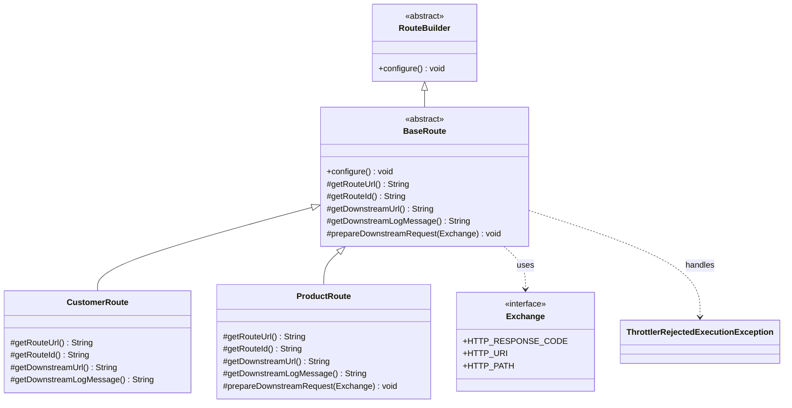
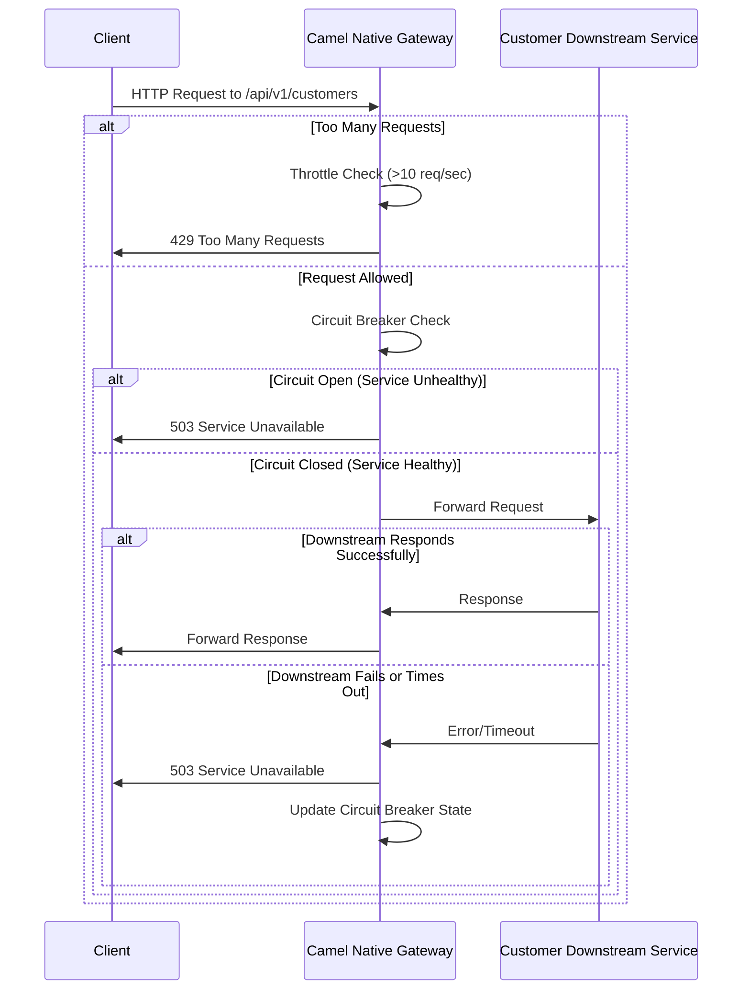
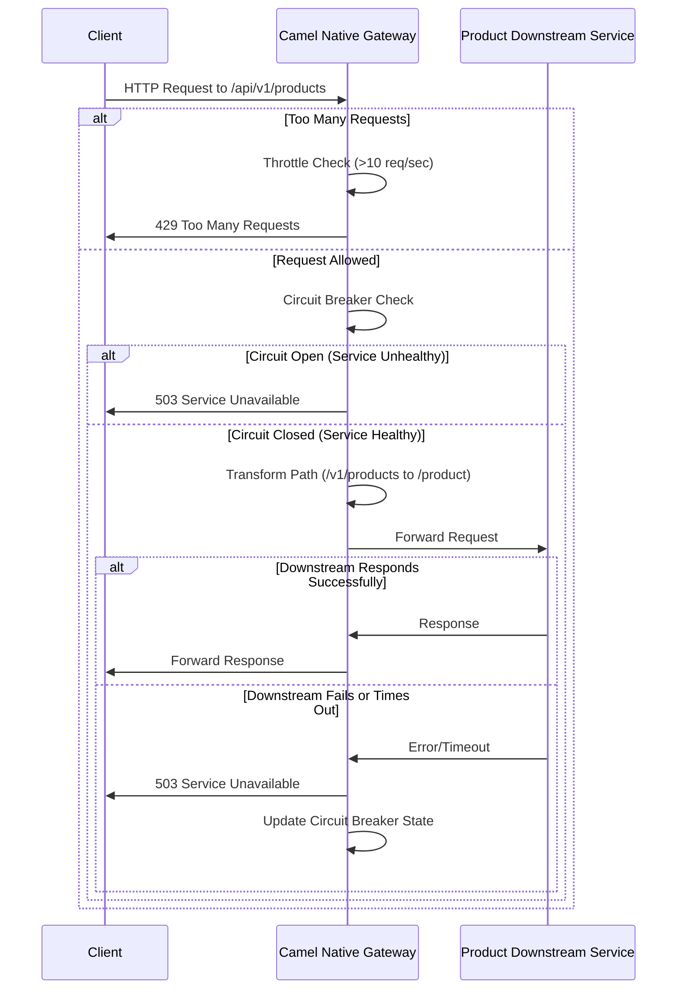

# Camel Native Gateway

A resilient API gateway built with Apache Camel on Quarkus, designed to be compiled to a native executable for optimal performance and minimal resource usage.

## Project Overview

This project implements an API gateway pattern using Apache Camel on Quarkus. It provides:

- Request throttling to prevent overloading downstream services
- Circuit breaking to handle downstream service failures gracefully
- Fault tolerance with configurable timeouts
- Native executable support for minimal resource usage and fast startup

## Architecture

### Class Diagram



### Sequence Diagrams

#### Customer Route



#### Product Route



## Setup and Usage

### Prerequisites

- JDK 21
- Maven 3.8+
- GraalVM or Mandrel (for native builds)
- Docker (optional, for containerized builds)

### Configuration

The application is configured via `application.properties`:

```properties
# HTTP port
quarkus.http.port=8080

# Logging configuration
quarkus.log.level=INFO
quarkus.log.category."com.edw".level=${LOG_LEVEL:DEBUG}
quarkus.log.console.format=%d{yyyy-MM-dd HH:mm:ss,SSS} %h  %-5p [%c{3.}] (%t) %s%e%n

# Disable sending anonymous statistics
quarkus.analytics.disabled=true

# Downstream service URLs (can be overridden with environment variables)
downstream.service.url.customer=${DOWNSTREAM_SERVICE_URL_CUSTOMER:http\://localhost:80}
downstream.service.url.product=${DOWNSTREAM_SERVICE_URL_PRODUCT:https\://ecommerce-middleware.apps-crc.testing}

# HTTP client timeouts
downstream.http.connectTimeout=2000
downstream.http.socketTimeout=2000
```

### Building the Application

#### JVM Mode

```bash
./mvnw clean package
```

#### Native Mode

```bash
./mvnw clean package -Dnative
```

#### Using Docker

```bash
docker build -f Dockerfile.multistage -t camel-native-gateway .
```

### Running the Application

#### JVM Mode

```bash
java -jar target/quarkus-app/quarkus-run.jar
```

#### Native Mode

```bash
./target/camel-native-gateway-1.0-SNAPSHOT-runner
```

#### Using Docker

```bash
docker run -p 8080:8080 camel-native-gateway
```

### Environment Variables

- `LOG_LEVEL`: Log level for com.edw package (default: DEBUG)
- `DOWNSTREAM_SERVICE_URL_CUSTOMER`: URL of the downstream customer service (default: http://localhost:80)
- `DOWNSTREAM_SERVICE_URL_PRODUCT`: URL of the downstream product service (default: https://ecommerce-middleware.apps-crc.testing)

## API Endpoints

- `GET /api/v1/customers`: Proxies requests to the downstream customer service
- `GET /api/v1/products`: Proxies requests to the downstream product service (transforms path from "/v1/products" to "/product")

## Resilience Features

### Throttling

The gateway limits concurrent requests to 10 per second. Excess requests receive a 429 status code.

### Circuit Breaker

The circuit breaker opens after 5 failures with a 50% failure ratio, preventing cascading failures. When open, requests receive a 503 status code.

### Timeouts

Requests to downstream services have both connect and socket timeouts configured to 2 seconds (via downstream.http.connectTimeout and downstream.http.socketTimeout), preventing resource exhaustion.
